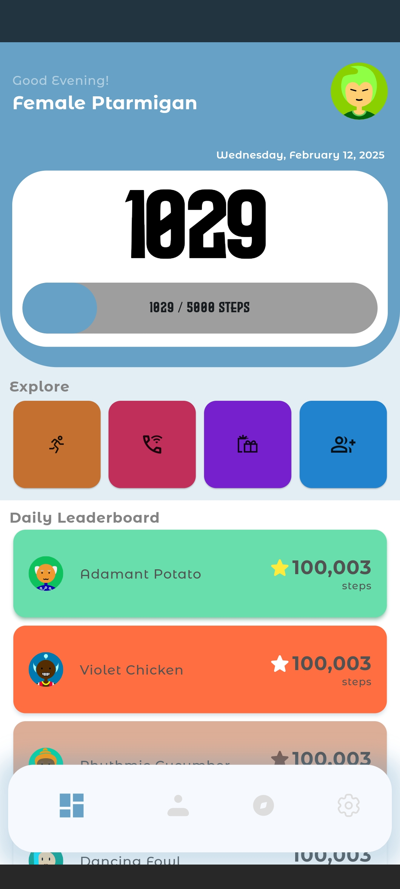
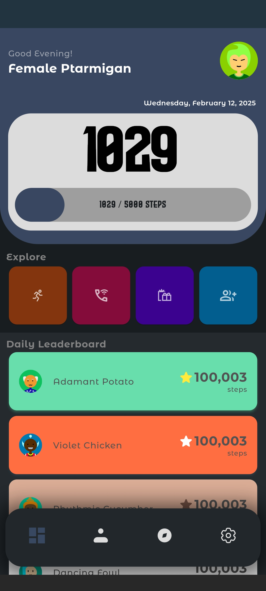
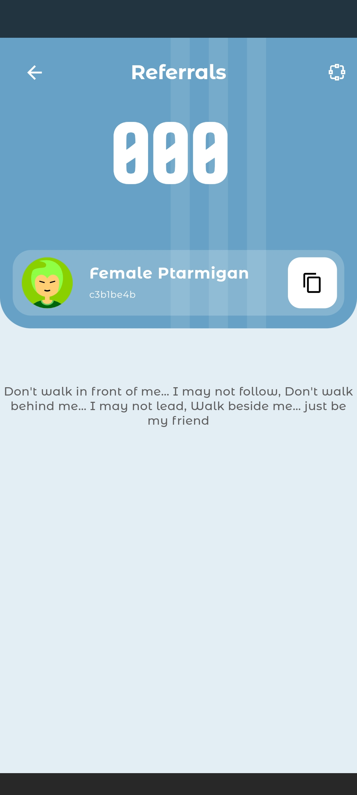
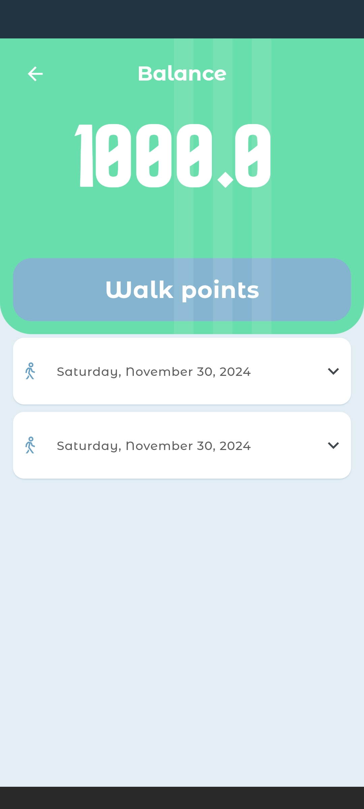

## Walk It 🚶‍♂️💰  
*A lifestyle dApp that pays you to walk*  

### 📌 Overview  
**Walk It** is a blockchain-powered lifestyle app that rewards users for walking. By tracking steps and converting physical activity into digital rewards, Walk It promotes an active lifestyle while integrating Web3 incentives.  

### 🔥 Features  
- 🚶 **Step Tracking** – Convert your daily steps into rewards  
- 🎁 **Earn Tokens** – Get rewarded for staying active  
- 🔗 **Blockchain Integration** – Secure, transparent, and decentralized  
- 📱 **Mobile-first Design** – Easy-to-use app for seamless tracking  
- 🛍️ **Redeem & Spend** – Use rewards for discounts, NFTs, or tokens  
- 🏛️ **Leaderboard** – View daily leaderboards

### 🚀 How It Works  
1. **Download the app** – Install Walk It on your mobile device  
2. **Connect your wallet** – Securely link your crypto wallet  
3. **Start walking** – Track your steps automatically  
4. **Earn rewards** – Convert steps into tokens  
5. **Redeem & enjoy** – Spend your earnings within the ecosystem  

### 🏗️ Tech Stack  
- **Frontend:** Flutter (Dart)  
- **Backend:** Python (Django)  
- **Blockchain:** XRPL-EVM, Shimmer ...
- **Database:** PostgreSQL

### 📜 Smart Contract  
- EVM contracts written in **Vyper** for security.
- Contracts implement rewards distribution system  

### 🛠️ Setup & Installation  
1. **Clone the repository**  
   ```bash
   git clone https://github.com/ObiajuluM/walk-it.git
   cd walk-it
   ```
2. **Install dependencies**  
   ```bash
   flutter pub get  # Frontend  
   ```
3. **Run the mobile app**  
   ```bash
   flutter run  
   ```

### 🎯 Roadmap  
- [x] Step tracking integration  
- [ ] Wallet connection & authentication  
- [x] Rewards algorithm implementation  
- [x] UI/UX enhancements  
- [ ] Beta launch  

### 🤝 Contributing  
Contributions are welcome! Feel free to open an issue or submit a pull request.  





[]
---

Let me know if you want to tweak anything! 🚀